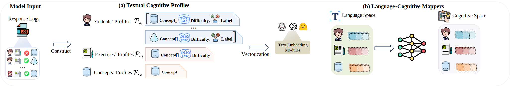
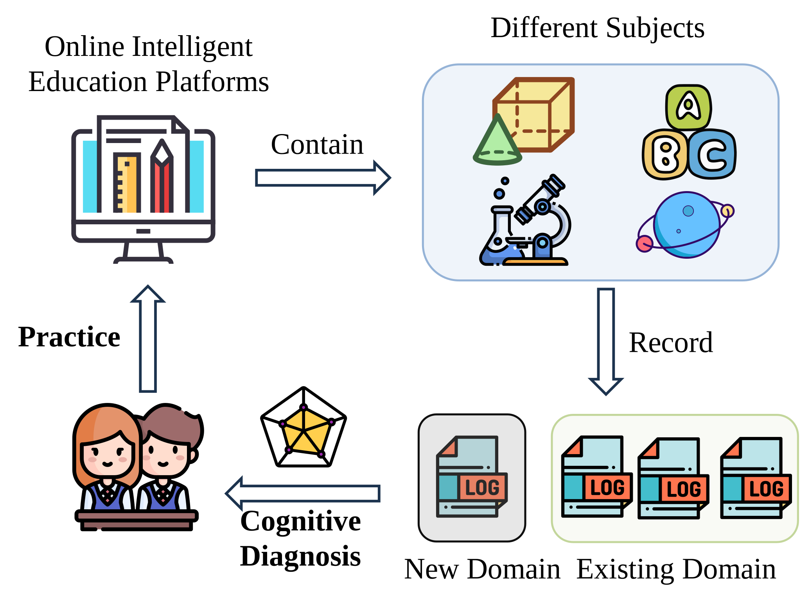
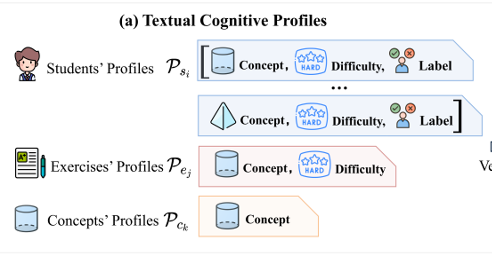
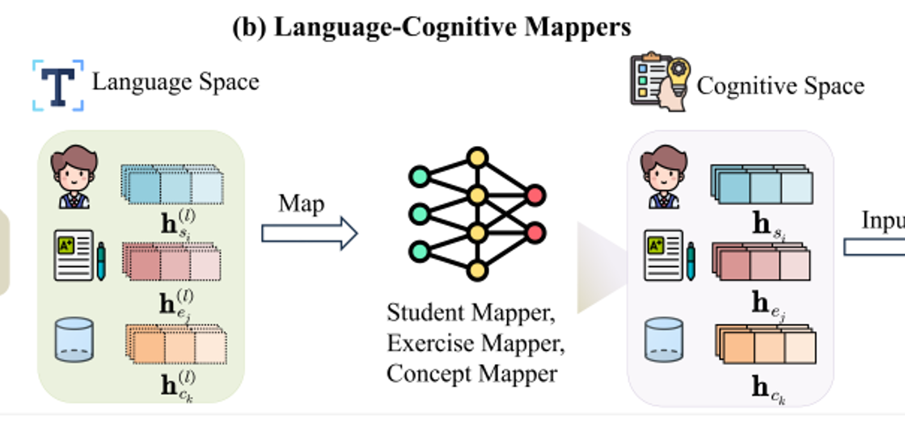
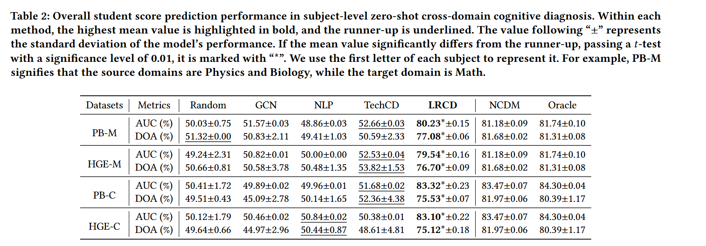
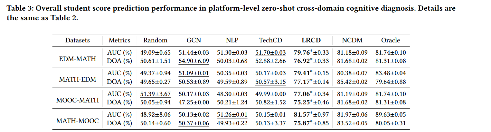
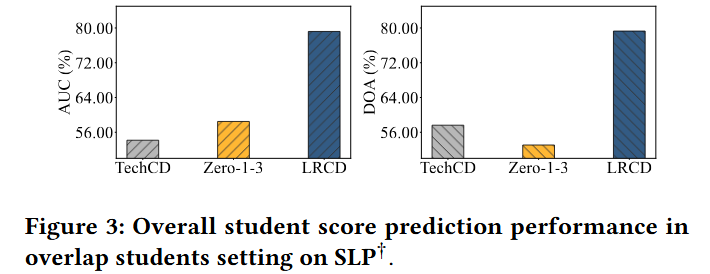

<div align='center'>
<h1>Language Representation Favored Zero-Shot Cross-Domain Cognitive Diagnosis KDD 2025</h1>
<a href='https://scholar.google.com/citations?user=sRoqbLwAAAAJ&hl=en'>Shuo Liu</a>,
<a href='https://aiedu.ecnu.edu.cn/'>Shanghai Institute of AI Education</a>, <a href='http://www.cs.ecnu.edu.cn/'>School of Computer Science and Technology</a>

East China Normal University

<!-- <a href='https://github.com/ECNU-ILOG/ORCDF'></a> -->
<!-- <a href='https://github.com/ECNU-ILOG/ORCDF/blob/main/ORCDF-KDD-2024.pdf'></a> -->



</div>

------


:smile_cat: Welcome to LRCD, this is a comprehensive repository specializing in ***Language Representation Favored Zero-Shot Cross-Domain Cognitive Diagnosis*** published in KDD 2025.


# Introduction of LRCD: Challenge, Solution and Insights

## Challenge

Cognitive diagnosis aims to infer students' mastery levels based on their historical response logs. However, existing cognitive diagnosis models (CDMs), **which rely on ID embeddings, often have to train specific models on specific domains. This limitation may hinder their directly practical application in various target domains, such as different subjects (e.g., Math, English and Physics) or different education platforms (e.g., ASSISTments, Junyi Academy and Khan Academy).**




## Solution

To address this issue, this paper proposes language representation favored zero-shot cross-domain cognitive diagnosis (LRCD). Specifically, LRCD first **analyzes the behavior patterns of students, exercise and concepts in different domains, and then describe the profiles of students, exercises and concepts using textual descriptions (TCP).** Via recent advanced text-embedding modules, these profiles can be transformed to vectors in the unified language space. Moreover, to address the discrepancy between the language space and the cognitive diagnosis space, we propose **language-cognitive mappers (LCM) in LRCD to learn the mapping from the former to the latter**. Then, these profiles can be simply and efficiently integrated and trained with existing CDMs.

<p float="left">
  
  
</p>

## Insights

LRCD is not only **model-agnostic but also scenario-agnostic**, meaning it can be applied across various contexts, including Transductive CD, Inductive CD, Zero-Shot CD and Computerized Adaptive Testing. 

### Zero-Shot CD (Same Platform, Different Subjects)




### Zero-Shot CD (Different Platform, Same Subjects)



### Overlap CD (Same Platform, Different Subjects, Overlap Students)



## 📰 News 
- [x] [2024.12.16] Upload the introduction.
- [x] [2024.12.6] LRCD v1.0 is released.

# Requirements	

```python
joblib==1.3.2
numpy==1.24.3
pandas==2.0.3
scikit-learn==1.3.2
scipy==1.10.1
torch==2.1.1
wandb==0.16.2
```
Please install all the dependencies listed in the `requirements.txt` file by running the following command:

```bash
pip install -r requirements.txt
```

# Data Preprocess

You should process datasets by yourself, you need first 

> cd data

Noting: Due to some embedding text files being too large, we have zipped them. Before starting to run, you need to unzip all files.

# Experiments

Then, you can choose different diagnostic methods based on the provided dataset to run this code. Here is an example:

```shell
python main.py --method=orcdf --train_file=data/SLP-BIO,data/SLP-PHY --test_file=data/SLP-MAT --seed=0 --batch_size=256 --device=cuda:0 --epoch=20  --lr=2.5e-4 --latent_dim=64 --inter=kancd --ssl_temp=0.5  --ssl_weight=1e-3  --flip_ratio=0.15 --gcn_layers=3 --keep_prob=1.0 --weight_decay=0
```

 
